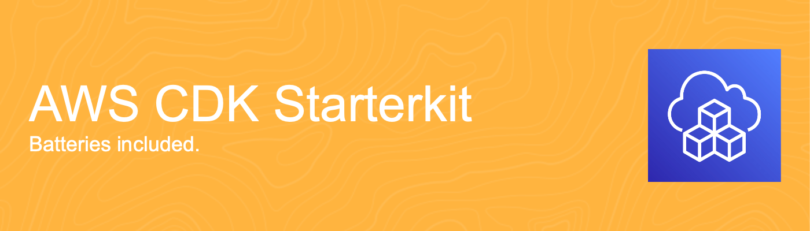

# [](https://towardsthecloud.com)

# AWS CDK Starterkit

> The perfect starter kit to create and deploy an AWS CDK App using TypeScript on your AWS account in less than 5 minutes using GitHub actions!

[](https://github.com/dannysteenman/aws-cdk-starterkit/actions/workflows/build.yml)
[](https://eslint.org)
[](https://github.com/dannysteenman/aws-cdk-starterkit/releases)

## Intro

Welcome to the starting line of your next AWS CDK project. This repository is crafted to supercharge your project's setup with AWS CDK TypeScript, projen, and GitHub actions, ensuring a smooth and efficient deployment to your AWS account.

> [!TIP]
> [Unlock the full potention of your infrastructure - Partner with Us!](#unlock-the-full-potention-of-your-infrastructure---partner-with-us)

## Features

- ⚡ **Rapid Setup**: Jumpstart your project within minutes by tweaking a [single configuration file](./.projenrc.ts). Spend less time on boilerplate and more on building.
- 🤹‍♂️ **Multi-Account Flexibility**: Ready for enterprises, this starter kit supports multi-account setups right from the start, enabling scalable and segregated cloud environments.
- 🤖 **Automated Deploy Pipelines**: Embrace CI/CD with out-of-the-box GitHub Actions workflows, automating your deployment processes for efficiency and reliability.
- 🏗️ **Project structure**: The [project is structured](#project-structure) in a clean and intuitive way that allows you to easily manage your constructs and stacks for this CDK App.
- 🛡️ **Seamless Security**: Leverage OpenID Connect for secure AWS deployments. Authenticate your GitHub Actions workflows directly with AWS, eliminating the need for stored credentials or long-lived secrets.
- 🧹 **Preconfigured TypeScript Excellence**: Hit the ground running with pre-set compiler options in [tsconfig.json](./tsconfig.json), ensuring your code is clean, efficient, and error-free from the start.
- 📏 **Best Practice Linting**: Adopt coding best practices effortlessly with a pre-configured ESLint setup [.eslintrc.json](./.eslintrc.json), maintaining high code quality and consistency.
- 💻 **Branch-based Deployments**: Deploy multiple CDK stacks to the same AWS environments based on the Git branch. This enables you to easily test changes when multiple developers work on the same code base.
- 📦 **Automated Dependency Management**: Dependabot creates grouped PRs, with auto-approval for passing checks using `hmarr/auto-approve-action@v4`, streamlining updates while maintaining project stability.

## Setup Guide

This project requires a atleast **Node.js version 20**.

All the config that is needed to personalise the CDK App to your environment is defined in the [.projenrc.ts file](./.projenrc.ts).

**To get started, follow these steps:**

1. Fork / clone this repo

2. Add a Personal Access Token to the repository settings on GitHub, follow these [instructions for setting up a fine-grained personal access token](https://projen.io/docs/integrations/github/#fine-grained-personal-access-token-beta).

3. Install the projects dependencies using: `npm ci`

4. Customize the AWS Region and Account IDs in the [.projenrc.ts](./.projenrc.ts) file to match your AWS setup:

```typescript
/* Define the AWS region for the CDK app and github workflows
Default to us-east-1 if AWS_REGION is not set in your environment variables */
const awsRegion = process.env.AWS_REGION || 'us-east-1';

// Define the target AWS accounts for the different environments
type Environment = 'test' | 'production';

interface EnvironmentConfig {
  accountId: string;
  enableBranchDeploy: boolean;
}

const environmentConfigs: Record<Environment, EnvironmentConfig> = {
  test: { accountId: '987654321012', enableBranchDeploy: true },
  production: { accountId: '123456789012', enableBranchDeploy: false },
};
```

5. Run `npx projen` to generate the github actions workflow files.

6. AWS CLI Authentication: Ensure you're logged into an AWS Account (one of the ones you configured in step 4) via the AWS CLI. If you haven't set up the AWS CLI, [then follow this guide](https://towardsthecloud.com/set-up-aws-cli-aws-sso))

7. Deploy the CDK toolkit stack to your AWS environment with `cdk bootstrap` if it's not already set up.

8. Deploy the GitHub OIDC Stack to enable GitHub Actions workflow permissions for AWS deployments. For instance, if you set up a `dev` environment, execute `npm run dev:deploy`.

9. Commit and push your changes to the `main` branch to trigger the CDK deploy pipeline in GitHub.

Congratulations 🎉! You've successfully set up your project.

## Project Structure

When working on smaller projects using infrastructure as code, where you deploy single applications that don’t demand extensive maintenance or collaboration from multiple teams, it’s recommended to structure your AWS CDK project in a way that enables you to deploy both the application and infrastructure using a single stack.

However, as projects evolve to encompass multiple microservices and a variety of stateful resources (e.g., databases), the complexity inherently increases.

In such cases, adopting a more sophisticated AWS CDK project organization becomes critical. This ensures not only the ease of extensibility but also the smooth deployment of each component, thereby supporting a more robust development lifecycle and facilitating greater operational efficiency.

To cater to these advanced needs, your AWS CDK project should adopt a modular structure. This is where the **AWS CDK starterkit** shines ✨.

Here’s a closer look at how this structure enhances maintainability and scalability:

```bash
.
├── cdk.context.json
├── cdk.json
├── LICENSE
├── package-lock.json
├── package.json
├── README.md
├── src
│   ├── assets
│   │   ├── ecs
│   │   │   └── example-container
│   │   └── lambda
│   │       └── example-lambda-function
│   ├── bin
│   │   ├── cicd-helper.ts
│   │   ├── env-helper.ts
│   │   └── git-helper.ts
│   ├── constructs
│   │   ├── base-construct.ts
│   │   ├── index.ts
│   │   ├── network-construct.ts
│   │   └── README.md
│   ├── main.ts
│   └── stacks
│       ├── foundation-stack.ts
│       ├── index.ts
│       ├── README.md
│       └── starter-stack.ts
├── test
│   ├── __snapshots__
│   │   └── main.test.ts.snap
│   └── main.test.ts
├── tsconfig.dev.json
└── tsconfig.json
```

As you can see in the above tree diagram, the way this project is setup it tries to segment it into logical units, such as **constructs** for reusable infrastructure patterns, **stacks** for deploying groups of resources and **assets** for managing source code of containers and lambda functions.

Here is a brief explanation of what each section does:

- `src/assets`: Organizes the assets for your Lambda functions and ECS services, ensuring that the application code is neatly encapsulated with the infrastructure code.
- `src/bin`: Contains utility scripts (e.g., `cicd-helper.ts`, `env-helper.ts`, `git-helper.ts`) that streamline environment setup and integration with CI/CD pipelines.
- `src/constructs`: Houses the core building blocks of your infrastructure. These constructs can be composed into higher-level abstractions, promoting reusability across different parts of your infrastructure. Check out the [README in the constructs folder](./src/constructs/README.md) to read how you can utilize environment-aware configurations.
- `src/stacks`: Dedicated to defining stacks that represent collections of AWS resources (constructs). This allows for logical grouping of related resources, making it simpler to manage deployments and resource dependencies. Check out the [README in the stacks folder](./src/stacks/README.md) to read how you can instantiate new stacks.
- `src/lib/main.ts`: This is where the CDK app is instantiated.
- `test`: Is the location to store your unit or integration tests (powered by jest)

## Branch-based Deployments

This starter kit supports deploying multiple CDK stacks to the same AWS environments based on the Git branch. This enables you to easily test changes when multiple developers work on the same code base.

When you create a new feature branch and push it to the repository, the GitHub Actions workflow will automatically deploy the CDK stacks to the corresponding AWS environment (e.g., dev, test, staging) based on the branch name.

Additionally, the workflow includes a separate task to destroy the CDK stacks for the feature branch when the branch is deleted or the pull request is closed, ensuring that the resources are cleaned up after the testing is complete.

## Unlock the full potention of your infrastructure - Partner with us!

> [!TIP]
> Supercharge Your AWS Infrastructure with [Towards the Cloud](https://towardsthecloud.com). We ship well-architected, resilient, and cost-optimized AWS solutions designed to scale using Infrastructure as Code (IaC), tailoring cloud-native systems for businesses of all sizes.
>
> Our Approach:
>
> - **Tailored AWS Solutions**: Custom-built for your unique business needs
> - **Future-Proof Architecture**: Scalable designs that grow with you
> - **Empowerment Through Ownership**: Your vision, your infrastructure, our expertise
>
> Why Choose Us:
> - 10+ Years of AWS Experience
> - 7x AWS Certified, including DevOps Engineer & Solutions Architect Professional
> - Proven Track Record: 40% Average Reduction in Operational Costs
>
> Ready to elevate your AWS CDK Infrastructure?
>
> <a href="https://towardsthecloud.com/contact"></a>
> <details><summary>☁️ <strong>Discover more about my one-person business: Towards the Cloud</strong></summary>
>
> <br/>
>
> Hi, I'm Danny – AWS expert and founder of [Towards the Cloud](https://towardsthecloud.com). With over a decade of hands-on experience, I specialized myself in deploying well-architected, highly scalable and cost-effective AWS Solutions using Infrastructure as Code (IaC).
>
> #### When you work with me, you're getting a package deal of expertise and personalized service:
>
> - **AWS CDK Proficiency**: I bring deep AWS CDK knowledge to the table, ensuring your infrastructure is not just maintainable and scalable, but also fully automated.
> - **AWS Certified**: [Equipped with 7 AWS Certifications](https://www.credly.com/users/dannysteenman/badges), including DevOps Engineer & Solutions Architect Professional, to ensure best practices across diverse cloud scenarios.
> - **Direct Access**: You work with me, not a team of managers. Expect quick decisions and high-quality work.
> - **Tailored Solutions**: Understanding that no two businesses are alike, I Custom-fit cloud infrastructure for your unique needs.
> - **Cost-Effective**: I'll optimize your AWS spending without cutting corners on performance or security.
> - **Seamless CI/CD**: I'll set up smooth CI/CD processes using GitHub Actions, making changes a breeze through Pull Requests.
>
> *My mission is simple: I'll free you from infrastructure headaches so you can focus on what truly matters – your core business.*
>
> Ready to unlock the full potential of AWS Cloud?
>
> <a href="https://towardsthecloud.com/contact"></a>
> </details>

## AWS CDK Starterkit for Python Users

> **Looking for the Python version of this AWS CDK starter kit?** Check out the [AWS CDK Python Starterkit](https://github.com/dannysteenman/aws-cdk-python-starterkit) for a tailored experience that leverages the full power of AWS CDK with Python.

## Acknowledgements

A heartfelt thank you to the creators of [projen](https://github.com/projen/projen). This starter kit stands on the shoulders of giants, made possible by their pioneering work in simplifying cloud infrastructure projects!

## Author

[Danny Steenman](https://towardsthecloud.com/about)

[](https://www.linkedin.com/in/dannysteenman)
[](https://twitter.com/dannysteenman)
[](https://github.com/dannysteenman)
